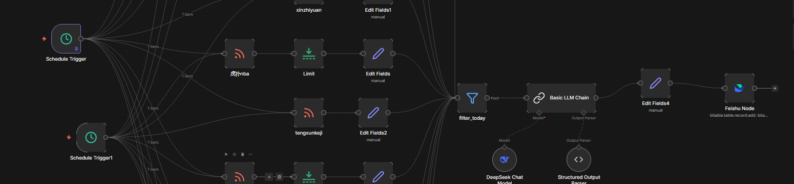
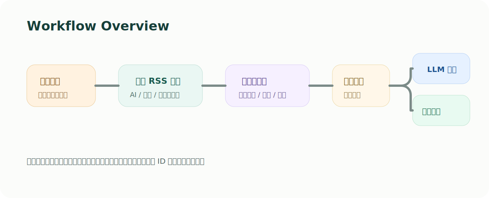
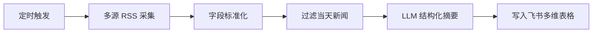
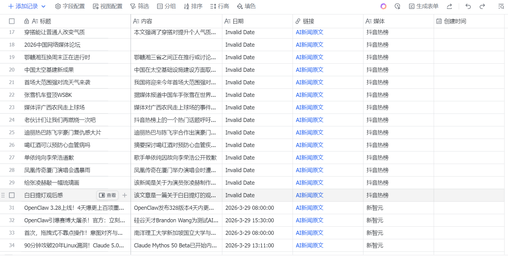

# AI 新闻自动采集与摘要工作流



这是一个基于 `n8n` 的新闻自动化项目示例：定时抓取多源 RSS 内容，筛选当天新闻，调用大模型生成结构化摘要，再写入飞书多维表格。

## 项目亮点

- 多源新闻采集：通过多个 RSS 节点抓取 AI / 科技类资讯。
- 自动清洗与标准化：统一字段为标题、日期、正文、链接、来源。
- 当日新闻过滤：只保留当天发布的内容，降低噪声。
- LLM 摘要整理：将新闻整理为结构化摘要，方便后续存储和阅读。
- 飞书自动入库：将结果写入飞书多维表格，形成可持续积累的资讯库。

## 工作流概览





## 示例效果



工作流输出字段示例：

- `title`: 新闻标题
- `published_at`: 发布时间
- `summary`: 3-4 句摘要
- `source`: 来源名称
- `link`: 原文链接

## 技术栈

- `n8n`
- `RSS Feed Read`
- `Filter / Set / Limit`
- `DeepSeek`
- `Feishu Bitable`

## 目录结构

```text
.
├─ README.md
├─ docs
│  ├─ import-guide.md
│  └─ sanitization-notes.md
├─ images
│  ├─ cover.svg
│  ├─ result-preview.svg
│  └─ workflow-overview.svg
└─ workflow
   └─ news-automation-sanitized.json
```

## 如何导入 n8n

1. 打开 n8n。
2. 选择 `Import from File`。
3. 导入 `workflow/news-automation-sanitized.json`。
4. 配置 `DeepSeek` 凭证。
5. 将飞书节点中的 `APP_TOKEN_PLACEHOLDER` 和 `TABLE_ID_PLACEHOLDER` 替换成你自己的表格信息。
6. 保存后手动执行一次，确认数据流转正常。

更详细的配置步骤见 [docs/import-guide.md](docs/import-guide.md)。

## 公开版说明

仓库中的工作流是公开展示用的脱敏版本，已移除或替换以下内容：

- 飞书 `app token`
- 飞书 `table id`
- 凭证 ID 与账户引用
- 原始实例标识
- 真实采集源的具体配置细节

本仓库额外补充了流程图和结果示意图，方便快速理解工作流结构和输出效果。
