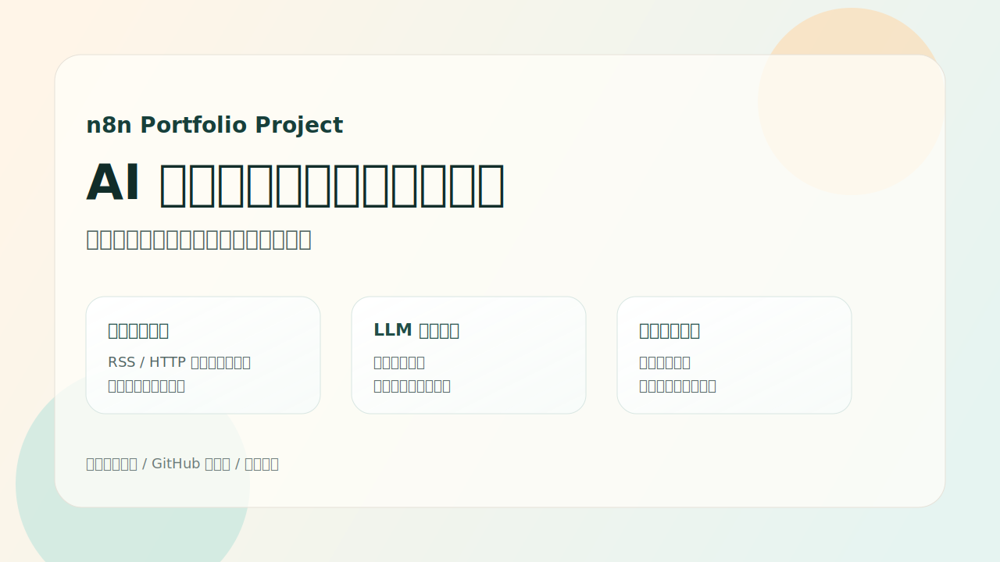
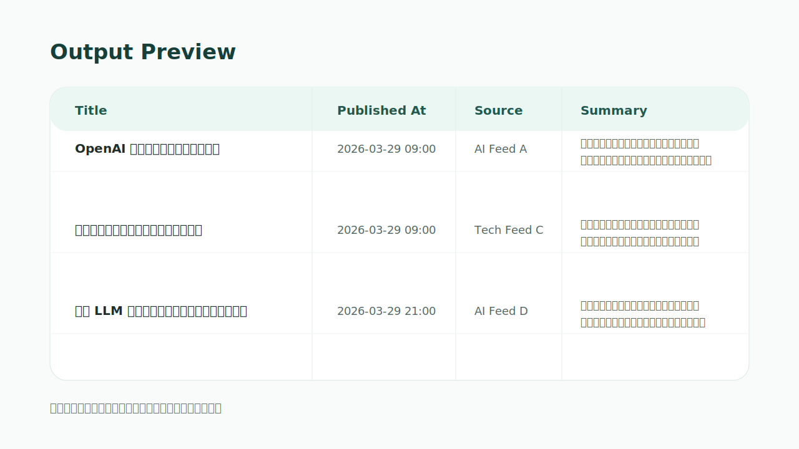

# AI 鏂伴椈鑷姩閲囬泦涓庢憳瑕佸伐浣滄祦



杩欐槸涓€涓熀浜?`n8n` 鐨勬柊闂昏嚜鍔ㄥ寲椤圭洰绀轰緥锛氬畾鏃舵姄鍙栧婧?RSS 鍐呭锛岀瓫閫夊綋澶╂柊闂伙紝璋冪敤澶фā鍨嬬敓鎴愮粨鏋勫寲鎽樿锛屽啀鍐欏叆椋炰功澶氱淮琛ㄦ牸锛岄€傚悎浣滀负鑷姩鍖栨柟鍚戠殑姹傝亴浣滃搧灞曠ず銆?
## 椤圭洰浜偣

- 澶氭簮鏂伴椈閲囬泦锛氶€氳繃澶氫釜 RSS 鑺傜偣鎶撳彇 AI / 绉戞妧绫昏祫璁€?- 鑷姩娓呮礂涓庢爣鍑嗗寲锛氱粺涓€瀛楁涓烘爣棰樸€佹棩鏈熴€佹鏂囥€侀摼鎺ャ€佹潵婧愩€?- 褰撴棩鏂伴椈杩囨护锛氬彧淇濈暀褰撳ぉ鍙戝竷鐨勫唴瀹癸紝闄嶄綆鍣０銆?- LLM 鎽樿鏁寸悊锛氬皢鏂伴椈鏁寸悊涓虹粨鏋勫寲鎽樿锛屾柟渚垮悗缁瓨鍌ㄥ拰闃呰銆?- 椋炰功鑷姩鍏ュ簱锛氬皢缁撴灉鍐欏叆椋炰功澶氱淮琛ㄦ牸锛屽舰鎴愬彲鎸佺画绉疮鐨勮祫璁簱銆?
## 宸ヤ綔娴佹瑙?
![宸ヤ綔娴佹瑙圿(images/workflow-overview.svg)

```mermaid
flowchart LR
    A["瀹氭椂瑙﹀彂"] --> B["澶氭簮 RSS 閲囬泦"]
    B --> C["瀛楁鏍囧噯鍖?]
    C --> D["杩囨护褰撳ぉ鏂伴椈"]
    D --> E["LLM 缁撴瀯鍖栨憳瑕?]
    E --> F["鍐欏叆椋炰功澶氱淮琛ㄦ牸"]
```

## 绀轰緥鏁堟灉



宸ヤ綔娴佽緭鍑哄瓧娈电ず渚嬶細

- `title`: 鏂伴椈鏍囬
- `published_at`: 鍙戝竷鏃堕棿
- `summary`: 3-4 鍙ユ憳瑕?- `source`: 鏉ユ簮鍚嶇О
- `link`: 鍘熸枃閾炬帴

## 鎶€鏈爤

- `n8n`
- `RSS Feed Read`
- `Filter / Set / Limit`
- `DeepSeek`
- `Feishu Bitable`

## 鐩綍缁撴瀯

```text
.
鈹溾攢 README.md
鈹溾攢 docs
鈹? 鈹溾攢 import-guide.md
鈹? 鈹溾攢 publish-checklist.md
鈹? 鈹斺攢 sanitization-notes.md
鈹溾攢 images
鈹? 鈹溾攢 cover.svg
鈹? 鈹溾攢 result-preview.svg
鈹? 鈹斺攢 workflow-overview.svg
鈹斺攢 workflow
   鈹斺攢 news-automation-sanitized.json
```

## 濡備綍瀵煎叆 n8n

1. 鎵撳紑 n8n銆?2. 閫夋嫨 `Import from File`銆?3. 瀵煎叆 `workflow/news-automation-sanitized.json`銆?4. 閰嶇疆 `DeepSeek` 鍑瘉銆?5. 灏嗛涔﹁妭鐐逛腑鐨?`APP_TOKEN_PLACEHOLDER` 鍜?`TABLE_ID_PLACEHOLDER` 鏇挎崲鎴愪綘鑷繁鐨勮〃鏍间俊鎭€?6. 淇濆瓨鍚庢墜鍔ㄦ墽琛屼竴娆★紝纭鏁版嵁娴佽浆姝ｅ父銆?
鏇磋缁嗙殑閰嶇疆姝ラ瑙?[docs/import-guide.md](docs/import-guide.md)銆?
## 鍏紑鐗堣鏄?
浠撳簱涓殑宸ヤ綔娴佹槸鍏紑灞曠ず鐢ㄧ殑鑴辨晱鐗堟湰锛屽凡绉婚櫎鎴栨浛鎹互涓嬪唴瀹癸細

- 椋炰功 `app token`
- 椋炰功 `table id`
- 鍑瘉 ID 涓庤处鎴峰紩鐢?- 鍘熷瀹炰緥鏍囪瘑
- 鐪熷疄閲囬泦婧愮殑鍏蜂綋閰嶇疆缁嗚妭

涓轰簡璁╂嫑鑱樻柟鏇村鏄撶悊瑙ｉ」鐩紝鏈粨搴撻澶栬ˉ鍏呬簡娴佺▼鍥俱€佺粨鏋滅ず鎰忓浘鍜屽彂甯冭鏄庯紱鍥犳瀹冩瘮鍘熷瀵煎嚭鏂囦欢鏇撮€傚悎浣滀负浣滃搧灞曠ず銆?
## 绠€鍘嗗彲鐩存帴浣跨敤鐨勯」鐩弿杩?
`AI 鏂伴椈鑷姩閲囬泦涓庢憳瑕佺郴缁燂紙n8n 宸ヤ綔娴侀」鐩級`

鍙弬鑰冨涓嬭〃杩帮細

> 鍩轰簬 n8n 璁捐鏂伴椈鑷姩鍖栨祦绋嬶紝瀹氭椂鎶撳彇澶氭簮璧勮骞跺畬鎴愬瓧娈垫竻娲椼€佹棩鏈熻繃婊ゃ€丩LM 鎽樿鐢熸垚涓庨涔﹁〃鏍煎啓鍏ワ紝鎼缓鍙鐢ㄧ殑杞婚噺绾ц祫璁噰闆嗕笌鏁寸悊绯荤粺銆?
## 鍙戝竷鍒?GitHub

鏈湴浠撳簱宸茬粡鏁寸悊涓哄彲鍙戝竷缁撴瀯銆傛帴涓嬫潵鍙渶瑕侊細

1. 鍦?GitHub 鍒涘缓涓€涓叕寮€浠撳簱锛屼緥濡?`ai-news-automation-n8n`
2. 缁戝畾杩滅骞舵帹閫?3. 灏嗕粨搴撲富椤甸摼鎺ユ斁鍒扮畝鍘嗕腑

鍏蜂綋鍛戒护瑙?[docs/publish-checklist.md](docs/publish-checklist.md)銆?
